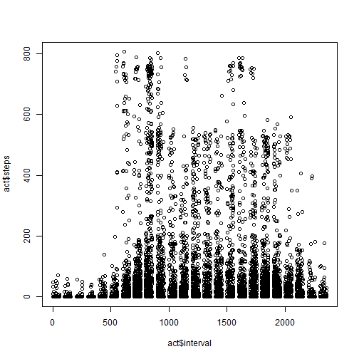
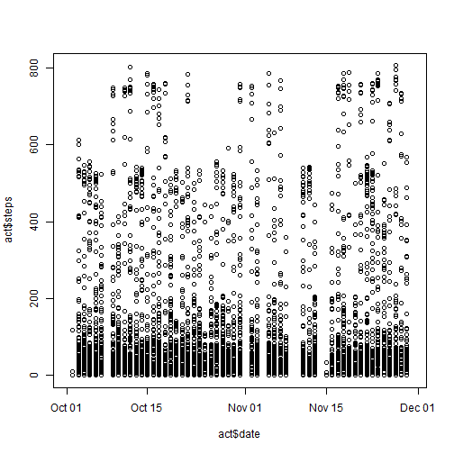
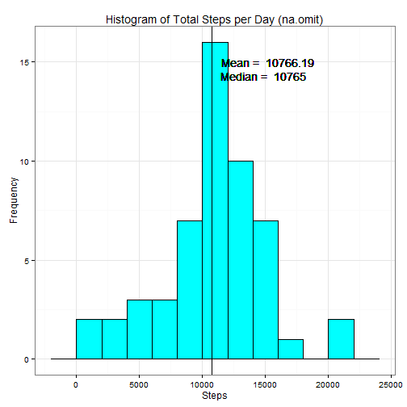
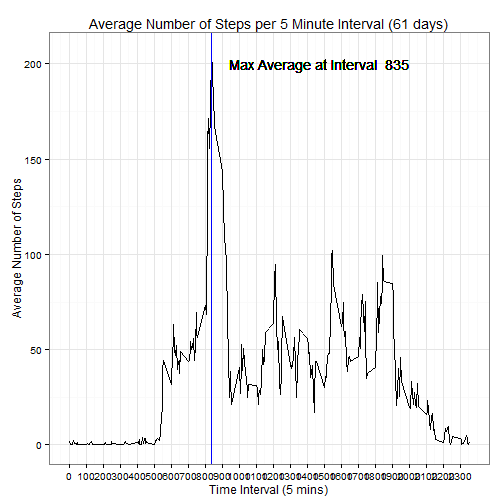
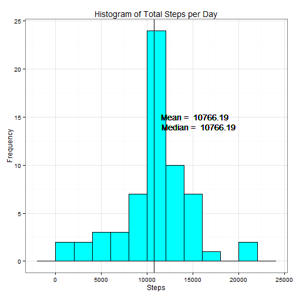
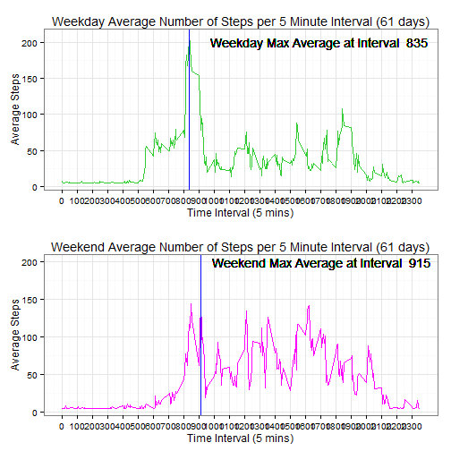

## Introduction

It is now possible to collect a large amount of data about personal movement using activity monitoring devices such as a Fitbit, Nike Fuelband, or Jawbone Up. These type of devices are part of the "quantified self" movement -- a group of enthusiasts who take measurements about themselves regularly to improve their health, to find patterns in their behavior, or because they are tech geeks. But these data remain under-utilized both because the raw data are hard to obtain and there is a lack of statistical methods and software for processing and interpreting the data.

This assignment makes use of data from a personal activity monitoring device. This device collects data at 5 minute intervals through out the day. The data consists of two months of data from an anonymous individual collected during the months of October and November, 2012 and include the number of steps taken in 5 minute intervals each day.

## Here is the plan
In this douments we will load the data and perform necessary preprocessing. A histogram will show the distribution of the total number of steps taken per day. The mean and median steps per day will be calculated. We will look at the average daily activity pattern. We will deal with missing values and see the effect on the outcome. Lastly, we will discover daily activity pattern differences between weekdays and weekends.

## Let's begin
### Prework - Load libraries

```r
library(ggplot2)
library(dplyr)
```

```
## 
## Attaching package: 'dplyr'
## 
## The following objects are masked from 'package:stats':
## 
##     filter, lag
## 
## The following objects are masked from 'package:base':
## 
##     intersect, setdiff, setequal, union
```

```r
library(plyr)
```

```
## -------------------------------------------------------------------------
## You have loaded plyr after dplyr - this is likely to cause problems.
## If you need functions from both plyr and dplyr, please load plyr first, then dplyr:
## library(plyr); library(dplyr)
## -------------------------------------------------------------------------
## 
## Attaching package: 'plyr'
## 
## The following objects are masked from 'package:dplyr':
## 
##     arrange, count, desc, failwith, id, mutate, rename, summarise,
##     summarize
```

```r
library(gridExtra)
```

### Loading and processing the data?
Read in data set and format the date variable.

```r
act <- read.csv("./activity.csv", colClasses = c("numeric", "character", "numeric"))
act$date <- as.Date(act$date, "%Y-%m-%d")
```

Get a feel for the data set and the elements

```r
dim(act)
```

```
## [1] 17568     3
```

```r
str(act)
```

```
## 'data.frame':	17568 obs. of  3 variables:
##  $ steps   : num  NA NA NA NA NA NA NA NA NA NA ...
##  $ date    : Date, format: "2012-10-01" "2012-10-01" ...
##  $ interval: num  0 5 10 15 20 25 30 35 40 45 ...
```

Plot some data to see what it looks like

```r
plot(act$interval, act$steps)
```

 

```r
plot(act$date, act$steps)
```

 

###What is the mean total number of steps taken per day? 
Remove missing data to calculate total steps per day as well as the mean and median values of this distribution. The histogram will be used to display these data. Print will be used to report the mean and median values. There is a special relationship between the mean and the median (and mode). Here are some links on the topic: http://www.math.fsu.edu/~wooland/hm/Unit2Module10/Unit2Module10.html, http://pinkmonkey.com/studyguides/subjects/stats/chap4/s0404601.asp, https://statistics.laerd.com/statistical-guides/measures-central-tendency-mean-mode-median.php

```r
cact <- na.omit(act)
s1day <- ddply(cact, .(cact$date), summarize, sumSteps = sum(steps))
print(meanday <- round(mean(s1day$sumSteps), digits = 2))
```

```
## [1] 10766.19
```

```r
print(medday <- median(s1day$sumSteps), digits = 2)
```

```
## [1] 10765
```

```r
plot1 <- ggplot(s1day, aes(s1day$sumSteps), xlab = "", ylab = "") +
        geom_histogram(color = 1, binwidth = 2000, fill = 5) + theme_bw() + 
        geom_vline(xintercept = meanday, color = "green") + 
        geom_text(aes(x=meanday, label=paste("Mean = ", meanday), y=15), colour="black", hjust = -0.1) +
        geom_vline(xintercept = medday, color = "black") +
        geom_text(aes(x=medday, label=paste("Median = ", medday), y=14.3), colour="black", hjust = -0.1) +
        xlab("Steps") +
        ylab("Frequency") +
        ggtitle("Histogram of Total Steps per Day (na.omit)")
print(plot1)
```

 

### What is the average daily activity pattern?
Remove missing data to calculate average steps per interval as well as finding the interval corresponding to the max value of this distribution. The time series plot will be used to disply these data.


```r
cact <- na.omit(act)
aint <- ddply(cact, .(interval), summarize, meanSteps = mean(steps))
print(mint <- aint$interval[aint$meanSteps == max(aint$meanSteps)])
```

```
## [1] 835
```

```r
g <- ggplot(aint, aes(x = interval, y = meanSteps), xlab = "", ylab = "")
g + geom_line() + 
     theme_bw() +
     xlab("Time Interval (5 mins)") +
     ylab("Average Number of Steps") +
     ggtitle("Average Number of Steps per 5 Minute Interval (61 days)") +
     scale_x_continuous(limits = c(0, 2355), breaks = round(seq(min(aint$interval), 
max(aint$interval), by = 100),1)) +
     geom_vline(xintercept = mint, color = "blue") +
     geom_text(aes(x=mint, label = paste("Max Average at Interval ", mint), y=200), colour = "black", hjust = -0.1)
```

 

### Impute missing values?
The total number of missing values in the activity.csv data set will be calculated and reported. Missing values will be imputed using the mean value for all steps. These imputed values will be used to fill in the missing values in the original data set. The histogram will be used to visualize the effect of missing values on calculations and data summaries as well as recalculating the mean and median of the distribution with imputed missing values.There are multiple discussions regarding missing data. Here are some links on the topic: http://www.bmj.com/content/338/bmj.b2393.extract, https://en.wikipedia.org/wiki/Imputation_(statistics), http://www.theanalysisfactor.com/missing-data-two-recommended-solutions/.


```r
actImp <- act
print(actImpNA <- sum(is.na(actImp$steps)))
```

```
## [1] 2304
```

```r
actImp$steps[is.na(actImp$steps)] <- mean(actImp$steps, na.rm = TRUE)  
sday <- ddply(actImp, .(actImp$date), summarize, sumSteps = sum(steps))
print(meanday <- round(mean(sday$sumSteps), digits = 2))
```

```
## [1] 10766.19
```

```r
print(medday <- round(median(sday$sumSteps), digits = 2))
```

```
## [1] 10766.19
```

```r
plot2 <- ggplot(sday, aes(sday$sumSteps), xlab = "", ylab = "") +
        geom_histogram(color = 1, binwidth = 2000, fill = 5) + theme_bw() + 
        geom_vline(xintercept = meanday, color = "green") + 
        geom_text(aes(x=meanday, label=paste("Mean = ", meanday), y=15), colour="black", hjust = -0.1) +
        geom_vline(xintercept = medday, color = "black") +
        geom_text(aes(x=medday, label=paste("Median = ", medday), y=14.0), colour="black", hjust = -0.1) +
        xlab("Steps") +
        ylab("Frequency") +
        ggtitle("Histogram of Total Steps per Day")
print(plot2)
```

 

### Are there differences in activity patterns between weekdays and weekends?
The weekdays() function is used on the imputed data set to create a new factor variable with two levels; "weekday" and "weekend" indicating whether a given date is a weekday or weekend day. A time series pane plot of the 5-minute interval (x-axis) and the average number of steps taken, averaged across all weekday days or weekend days (y-axis) is used to See if there are activity differences between weekdays and weekends.


```r
wd <- c("Saturday", "Sunday")
actImp$day <- factor(ifelse((weekdays(actImp$date) %in% wd), "weekend", "weekday"))
aint1 <- ddply(actImp, .(interval, day), summarize, meanSteps = mean(steps))
panewd <- aint1[aint1$day == "weekday", ]
print(mintwd <- panewd$interval[panewd$meanSteps == max(panewd$meanSteps)])
```

```
## [1] 835
```

```r
panewe <- aint1[aint1$day == "weekend", ]
print(mintwe <- panewe$interval[panewe$meanSteps == max(panewe$meanSteps)])
```

```
## [1] 915
```

```r
plotwd <- ggplot(panewd, aes(x = interval, y = meanSteps)) +
        geom_line(color = "limegreen") +
        theme_bw() +
        xlab("Time Interval (5 mins)") +
        ylab("Average Steps") +
        ggtitle("Weekday Average Number of Steps per 5 Minute Interval (61 days)") +
        scale_x_continuous(limits = c(0, 2355), breaks = round(seq(min(aint$interval), 
                                        max(aint$interval), by = 100),1)) +
        geom_vline(xintercept = mintwd, color = "blue") +
        geom_text(aes(x=mintwd, label = paste("Weekday Max Average at Interval ", mintwd), 
                      y=200), colour = "black", hjust = -0.1)
plotwe <- ggplot(panewe, aes(x = interval, y = meanSteps)) +
        geom_line(color = "magenta") +
        theme_bw() +
        xlab("Time Interval (5 mins)") +
        ylab("Average Steps") +
        ggtitle("Weekend Average Number of Steps per 5 Minute Interval (61 days)") +
        scale_x_continuous(limits = c(0, 2355), breaks = round(seq(min(aint$interval), 
                                        max(aint$interval), by = 100),1)) +
        geom_vline(xintercept = mintwe, color = "blue") +
        geom_text(aes(x=mintwe, label = paste("Weekend Max Average at Interval ", mintwe), 
                      y=200), colour = "black", hjust = -0.05)
grid.arrange(plotwd, plotwe)
```

 

